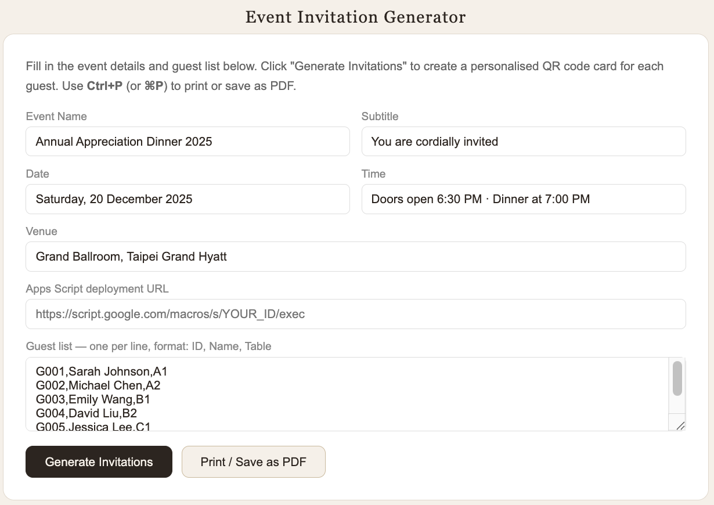
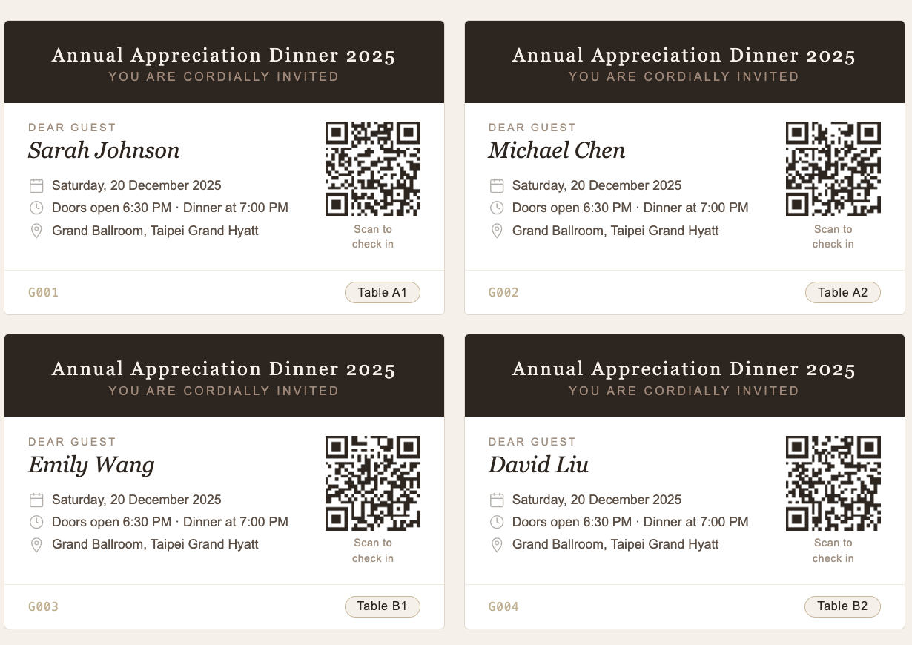
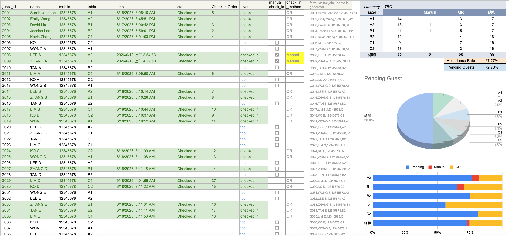
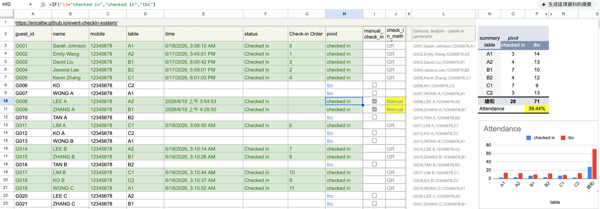
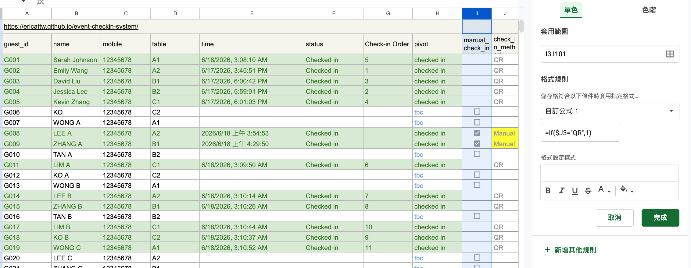
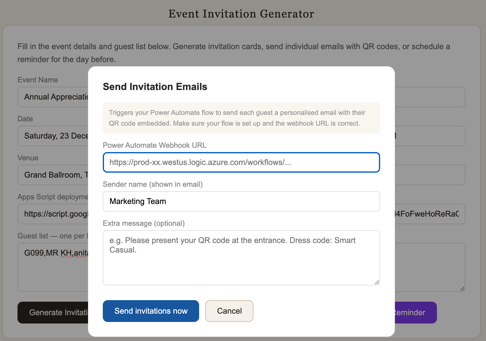
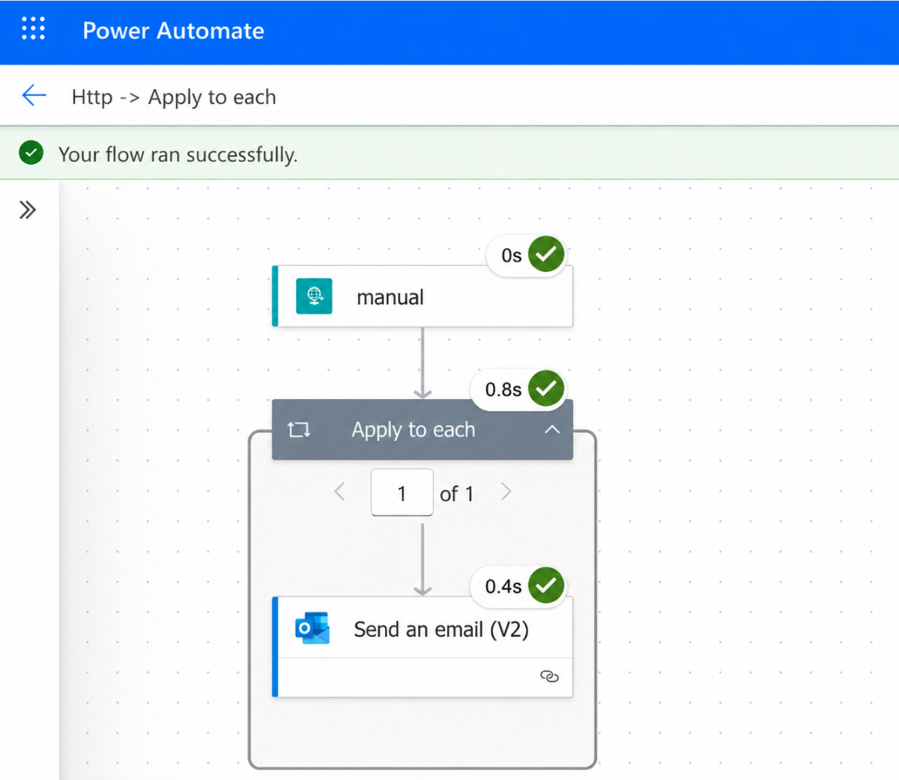

# Event Check-in System

## Project Overview

A QR code-based event check-in system built with Google Sheets, Apps Script, and HTML to automate attendance tracking and provide real-time event visibility.

---

## Business Use Case

Manual guest check-in typically causes long queues, duplicate entries, and inaccurate records.

This system digitises the entire check-in workflow:
- Guests receive a personalised QR code invitation via email (Power Automate + Outlook)
- Staff scan QR codes on any mobile browser — no app required
- Google Sheets updates instantly with check-in time, status, and arrival order
- A live pivot table dashboard tracks attendance rate per table in real time
- Manual check-in remains available as a backup to handle edge cases

---
## Skills Demonstrated

### Operations & Process Improvement
- Event operations workflow design
- Check-in process optimisation
- Real-time attendance monitoring

### Data & Reporting
- Google Sheets dashboard reporting
- Pivot table analysis
- Attendance tracking

### Technology & Automation
- Google Apps Script
- QR code generation
- Serverless application development
---

## Live Demo

 [Open Invitation Generator](https://ericattw.github.io/event-checkin-system/)





---

## Features

| Feature | Detail |
|---|---|
| QR invitation cards | Unique QR code generated per guest |
| Mobile scan check-in | Staff scan with any smartphone browser — no app needed |
| Manual check-in backup | Using Google Sheets checkbox |
| Real-time attendance tracking | Check-in time + status written to Google Sheets instantly |
| Conditional formatting for visual check-in status | Checked-in rows turn green automatically |
| Pivot table + chart | Live attendance rate per table, updates as guests arrive |
| Duplicate scan alert | Prevents the same QR being scanned twice |
| Email invitations & reminders | Send QR code invitations and day-before reminders via Power Automate + Outlook |
| Time-window protection | Check-in endpoint only accepts requests during the event window |

---
### Check-in Methods

The system supports two attendance registration methods:

| Method | Description |
|----------|----------|
| QR | Guest successfully checked in using the QR code |
| Manual | Event staff manually checked in the guest using the backup checkbox workflow |

This backup process ensures attendance can still be recorded even if guests experience issues with their QR code on the event day.

## Google Sheets Structure

[Google sheet example](https://docs.google.com/spreadsheets/d/1bgebyIcfRF0Nyj2fRIBG7M7Z4bpt8whXNlT9JqWORuo/edit?usp=sharing)

| Column | Field | Example |
|----------|----------|----------|
| A | guest_id | G001 |
| B | name | Sarah Johnson |
| C | email | sarah@email.com |
| D | table | A1 |
| E | mobile | 12345678 |
| F | time | 6/18/2026, 3:08:10 AM |
| G | status | Checked in |
| H | check_in_order | 5 |
| I | pivot (Helper Field) | checked in / tbc |
| J | manual_check_in | ☑ / ☐ |
| K | check_in_method | QR / Manual |
| L | textjoin | text for QR generator |

### Conditional Formatting Rules

- **Green row** — triggered when column I contains `"checked in"`  
  Formula: `=FIND("checked in",$I3)`
- **Pending** — column I shows `"tbc"` for guests not yet arrived

### Summary sheet (Pivot Table + Chart)

- Rows: table (A1, A2, B1 …)
- Columns: pivot field (`tbc` / `checked in`- Manual, QR)
- Values: count of guests
- Attendance % cell auto-calculates `checked in ÷ total`
- Bar chart visualises checked-in vs pending per table in real time



---

## Implementation Overview

### 1. Guest Registration & QR Generation

Guest information is maintained in Google Sheets. A helper column generates a unique QR payload for each attendee using the guest ID, name, mobile number, and assigned table.

The QR Invitation Generator converts the payload into individual QR code invitation cards that can be printed or shared digitally.

### 2. Event Check-in Process

On the event day, staff scan the guest's QR code using any mobile browser. The QR data is sent to a Google Apps Script web application, which validates the request and updates the attendance record in Google Sheets.

The system automatically records:
- Check-in timestamp
- Attendance status
- Check-in order
- Check-in method (QR)

### 3. Manual Check-in Backup

To handle event-day exceptions, a manual check-in workflow was implemented using Google Sheets checkboxes.

If a guest is unable to use their QR code, event staff can manually check in the guest. The system automatically updates:
- Check-in timestamp
- Attendance status
- Check-in method (Manual)

This ensures attendance tracking remains accurate even when QR scanning is unavailable.

### 4. Attendance Dashboard & Reporting

Attendance data is aggregated using Pivot Tables and visualised through a dashboard.

Key metrics include:
- Attendance Rate
- Checked-in Guests
- Pending Guests
- Attendance by Table
- QR vs Manual Check-in Tracking

The dashboard updates automatically as guests arrive, providing organisers with real-time visibility into event attendance.

---

## Project Structure

```text
event-checkin-system/
├── apps-script/
│   └── Code.gs                           # Google Apps Script backend (QR + Manual Check-in)
├── images/
│   ├── dashboard-checkedin-report.png    # Attendance dashboard
│   ├── deployment.png                    # Apps Script deployment guide
│   ├── invitation-generator.png          # Invitation generator interface
│   ├── manual-checkedin.png              # Manual check-in workflow
│   ├── manual-checkedin-formatting.png   # Conditional formatting rules
│   ├── Send-Invitation.png               # Invitation email generation workflow
│   ├── Power-Automate-Flow.png           # Automated email reminder flow
│   └── Email-output.png                  # Sample invitation email output
├── index.html                            # QR invitation generator
└── README.md                             # Project documentation
```

## ⚙️ Setup & Deployment (Quick Start)

The deployment process takes less than 5 minutes. Click the section below for full step-by-step instructions.

<details>
<summary><b>📖 Click to expand full Step-by-Step Setup Guide</b></summary>

### Step 1 — Google Sheets setup

1. Go to [sheets.google.com](https://sheets.google.com) and create a new spreadsheet
2. Rename the first tab **`Guest List`**
3. Add these headers in row 1:

```
guest_id | name | email | table | mobile | time | status | Check-in Order | pivot | manual_check_in | check_in_method | textjoin |
```

4. Fill in guest data from row 2 onwards (columns F–K are auto-filled on check-in)

---

### Step 2 — Helper column formula (column I)

In cell **I3**, enter and drag down to I100:

```
=IF(G3="checked in","checked in","tbc")
```
---

### Step 3 — Generate QR Payload (Column L)

Create a helper field to generate the QR code payload.

In cell `L3`:

```excel
=TEXTJOIN(",",TRUE,$A3:$E3)
```

Example output:

```text
G001,Sarah Johnson,sarah@email.com,12345678,A1
```

This value is copied into the QR Code Generator and embedded into each guest's QR code.

Drag the formula down to generate QR payloads for all guests.

---

### Step 4 – Conditional Formatting (Column I)

1. Select range **A3:I100**
2. Format → Conditional formatting → Add rule
3. Custom formula: `=IF(FIND("checked in",$I3),1,0)`
4. Set fill colour to green → Done

---

### Step 5 – Attendance Dashboard (Pivot Table + Chart)

1. Insert → Pivot table → New sheet → rename it **`Summary`**
2. Rows: `table` · Columns: `pivot` · Values: `guest_id` (count)
3. Add attendance % formula below the pivot:

```
=GETPIVOTDATA("guest_id",A3,"pivot","checked in") /
 (GETPIVOTDATA("guest_id",A3,"pivot","checked in") +
  GETPIVOTDATA("guest_id",A3,"pivot","tbc"))
```

4. Insert → Chart → Bar chart using the pivot table data

---





---

### Step 6 – Create New Pivot Reporting Worksheets

To support attendance tracking and post-event analysis, two synchronised reporting worksheets were created using Google Sheets Pivot Tables.

#### 1. Sync – Checked-in Guest Count

This worksheet automatically synchronises attendance records and generates a summary of guests who have successfully checked in.

**Features**

* Consolidates completed check-in records
* Displays guest details including name, mobile number, and assigned table
* Generates table-level attendance summaries using Pivot Tables
* Provides real-time visibility of attendance distribution across tables

**Business Value**

* Enables organisers to monitor attendance progress in real time
* Supports attendance rate calculation and event performance reporting
* Identifies table occupancy levels during the event
* Reduces manual counting and reconciliation efforts

---

#### 2. Sync – No-Show Guest Contact Information

This worksheet automatically compiles the contact details of guests who registered but did not attend the event by synchronising attendance records with the master guest list.

**Features**

* Identifies no-show guests based on attendance status
* Groups guests by assigned table
* Displays guest names and contact numbers for follow-up actions
* Supports post-event engagement and attendance analysis
* Reduces manual filtering and data preparation effort

**Business Value**

* Enables organisers to quickly contact absent guests after the event
* Supports no-show analysis and attendance trend reporting
* Improves event follow-up efficiency and customer relationship management
* Provides insights to improve future event attendance rates

### Step 7 – Google Apps Script Backend

1. Google Sheets → **Extensions → Apps Script**
2. Paste the code from [`apps-script/Code.gs`](apps-script/Code.gs)
3. **Update the event time window** to match your event:

```javascript
const EVENT_START = new Date("2025-12-20T18:00:00+08:00");
const EVENT_END   = new Date("2025-12-20T23:59:00+08:00");
```

4. Deploy → New deployment
   - Type: **Web App**
   - Execute as: **Me**
   - Who has access: **Anyone**
5. Copy the deployment URL

---

### Step 8 — Generate QR invitations

1. Open the Live Demo URL: https://ericattw.github.io/event-checkin-system/
2. Paste the Apps Script deployment URL
3. Enter guest list (`G001,Sarah Johnson,sarah@email.com,12345678,A1`)
4. Click **Generate Invitations** → Print or save as PDF

### Step 9 — Send emails via Power Automate (Optional)

1. Go to [flow.microsoft.com](https://flow.microsoft.com) and create a new instant cloud flow
2. Trigger: **When an HTTP request is received**
3. Add **Apply to each** → loop through guests array
4. Add **Send an email (V2)** inside the loop using Outlook
5. Copy the HTTP POST URL (webhook URL)
6. Paste the webhook URL into the generator when clicking **Send Invitation Emails** or **Send Day-Before Reminder**





---
### Step 10 — After the event

Go to Apps Script → **Manage Deployments → Archive** to permanently disable the check-in endpoint. QR codes become inert immediately.

---

</details>

---
## 🔒 Security Design

A key consideration in building this system was preventing abuse of the QR codes after the event.

| Threat | Protection |
|---|---|
| Someone scans a QR before the event | Time-window guard — requests outside the event window return `closed` and write nothing |
| Same QR scanned twice | Duplicate detection — second scan returns `duplicate` with no data change |
| Random / empty ID requests | Input validation — missing or blank IDs are rejected immediately |
| Sheet misconfiguration | Sheet existence check — returns a clear error instead of crashing |

The check-in endpoint is also easy to shut down permanently after the event via Apps Script → Manage Deployments → Archive.

---

## Key Learnings

- Designed and built a complete event operations tool from scratch with zero budget
- Connected a web frontend to Google Sheets using Apps Script as a serverless backend
- Implemented real-time data writing, duplicate scan detection, and arrival order tracking
- Added a time-window security guard to prevent QR code abuse outside the event
- Built conditional formatting and a live pivot table dashboard to monitor attendance
- Optimised HTML print layout for physical card production (A4, 2-up, page-break safe)

---

## Future Enhancements

* Generate automated post-event attendance reports
* Support multiple events within a single platform


## License
MIT — free to use and adapt.
